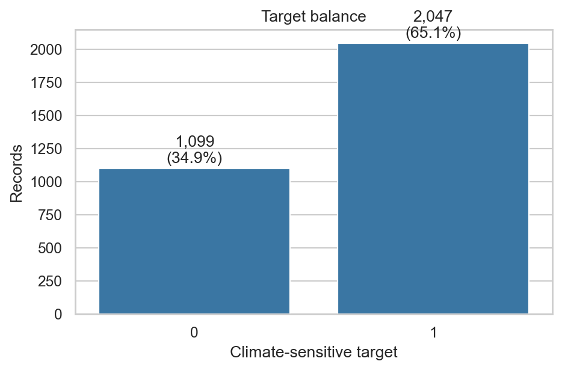
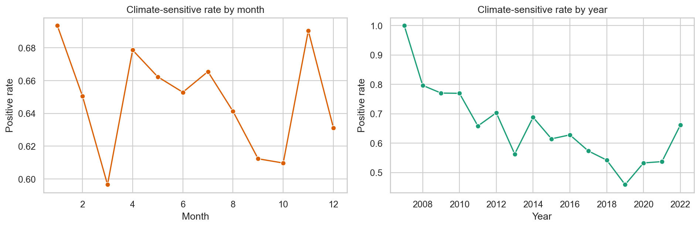
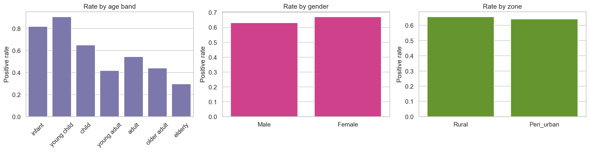
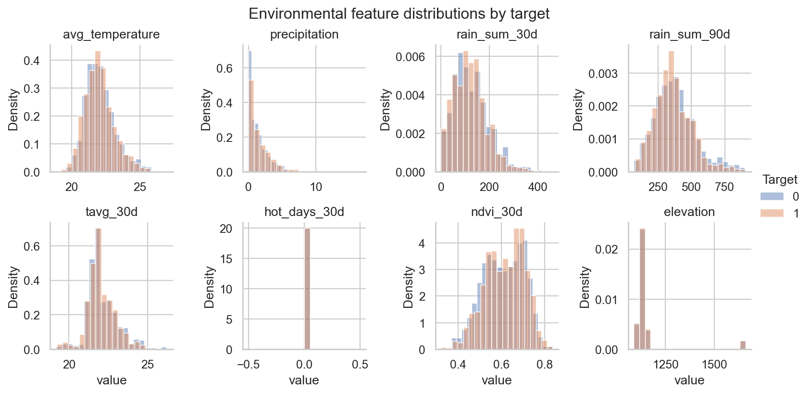
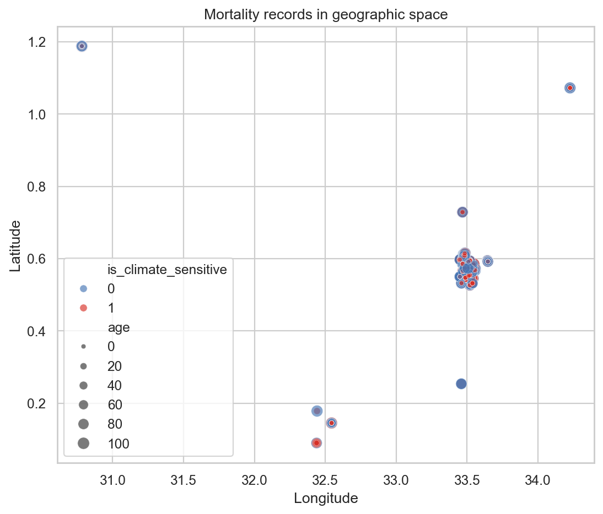
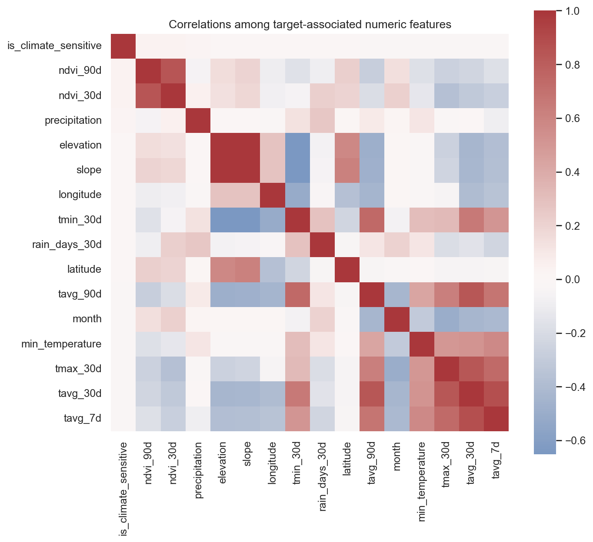
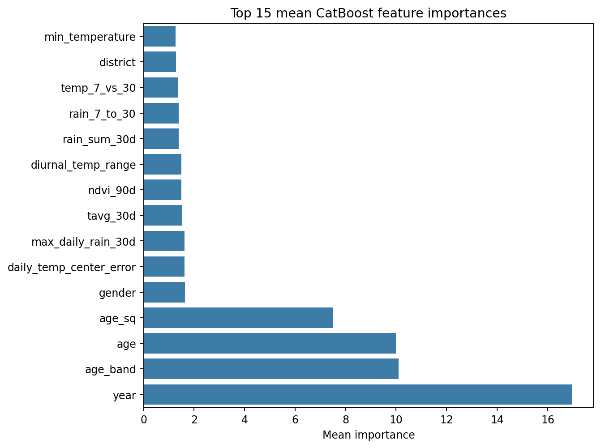

# Climate Risk & Health Prediction Challenge

An auditable, leakage-safe modeling pipeline for the Zindi Climate Risk and Health Prediction Challenge. The task is binary classification: predict whether a recorded death is climate-sensitive and submit both the raw probability and the required default-threshold label.

## Current result

The final candidate is a deterministic CatBoost ensemble over five stratified folds. It uses climate-enriched train/test rows, explicit feature engineering, a compact manual hyperparameter comparison, importance-ranked feature selection, and strict submission validation.

| Metric | Definition | Final run |
|---|---|---:|
| F1 | `F1(y, probability >= 0.5)` | **0.8101** |
| ROC-AUC | `ROC-AUC(y, probability)` | **0.8155** |
| Weighted score | `0.60 * F1 + 0.40 * ROC-AUC` | **0.8123** |

The strongest reproducible candidate is [`submissions/nasa_power_catboost_lgbm_blend_submission.csv`](submissions/nasa_power_catboost_lgbm_blend_submission.csv). The original all-feature CatBoost submission and selected-20 challenger remain available for comparison. No probability rounding or custom threshold is used.

## EDA at a glance

The supplied records are imbalanced toward climate-sensitive deaths, span multiple years and Ugandan locations, and include both demographic and environmental signals. The repository generates the full analysis under [`reports/figures`](reports/figures):















The numeric EDA tables are in [`reports/tables`](reports/tables), including dataset dimensions, group-level positive rates, CV fold results, feature importance, and feature-group importance.

## Modeling approach

1. Merge `Train.csv` and `Test.csv` with `climate_features.csv` by the provided `ID` key.
2. Derive calendar seasonality, age bands, temperature contrasts, rainfall accumulation ratios, NDVI change, heat/wetness proxies, spatial cells, and unsupervised support counts.
3. Fit CatBoost directly on mixed numeric/categorical features, preserving nonlinear climate interactions and location categories without target encoding.
4. Compare a small explicit parameter grid, then evaluate an importance-ranked top-`k` feature subset.
5. Average out-of-fold test predictions across five folds and produce labels exactly at `0.5`.
6. Validate row count, ID uniqueness, finite probabilities, probability bounds, required columns, and row order before writing the submission.

The code does not use mortality, demographic, socioeconomic, healthcare, disease, or cause-of-death data from outside the competition. This follows the organizer ruling recorded in the supplied participant comments: external additions are limited to climate/environmental observations and derived environmental indicators; record-level label lookups are excluded.

## Climate data used

`climate_features.csv` is the challenge-provided enrichment and is used in every final model. Its documented source products are:

- [CHIRPS rainfall](https://chc.ucsb.edu/data/chirps/) — rolling rainfall totals, wet-day counts, and extremes.
- [ERA5-Land reanalysis](https://cds.climate.copernicus.eu/datasets/reanalysis-era5-land?tab=documentation) — rolling temperature summaries and heat-day features.
- [NASA MODIS vegetation indices](https://modis.gsfc.nasa.gov/data/dataprod/mod13.php) — NDVI windows.
- [SRTM terrain](https://lpdaac.usgs.gov/products/srtmgl1v003/) — elevation and slope.
- [NASA POWER Daily API](https://power.larc.nasa.gov/docs/services/api/temporal/daily/point/) — independent daily temperature, precipitation, humidity, wind, radiation, evapotranspiration, and soil-moisture summaries.

These are climate/environmental covariates joined by the supplied row ID; no target-bearing external dataset is used.

## Reproduce

Put the challenge files in the project root (or pass another `--data-dir`):

```text
Train.csv
Test.csv
climate_features.csv
```

Install dependencies and run:

```bash
pip install -r requirements.txt
python scripts/run_pipeline.py
```

For individual stages:

```bash
python scripts/make_eda.py
python scripts/download_nasa_power.py
python scripts/tune_hyperparameters.py
python scripts/train_model.py
python scripts/select_features.py
python scripts/train_model.py
python scripts/blend_models.py
python scripts/validate_submission.py
python scripts/make_feature_report.py
```

Generated model binaries are intentionally ignored by Git. The public repository contains source, methodology, EDA, validation tables, and the submission schema; the raw challenge files remain local by default.

## Important caveat

Cross-validation is an estimate, not a leaderboard guarantee. The public/private split is hidden, so stability across folds and strict leakage controls matter more than chasing one optimistic validation split.
